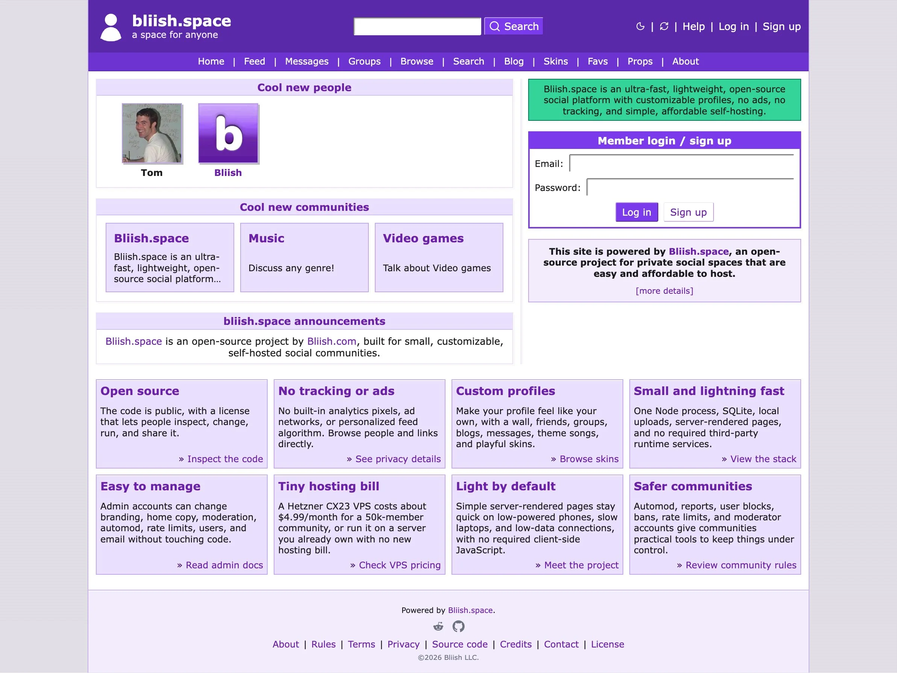

<div align="center">
  
  <h1>bliish.space</h1>
  <p><em>a space for anyone</em></p>
  <p>
    <a href="LICENSE"></a>
    
    
    
  </p>
</div>



[Bliish.space](https://bliish.space) is an **ultra-fast**, **lightweight**, **open-source social platform** with **customizable profiles**, **no ads**, **no tracking**, and **simple, affordable self-hosting**. It includes profiles, wall posts, friends, favorites, props, blogs, comments, groups, notifications, **private messages**, **automoderation**, and **user-friendly admin tools**.

> **Early release:** This project is under **active development**. Expect changes to **setup**, **deployment**, and **documentation**.

## Highlights

🔓 **Open source:** **GPL-3.0-only** code that people can inspect, change, run, and share.

🚫 **No tracking or ads:** No built-in analytics pixels, ad networks, or **personalized feed algorithm**.

🎨 **Custom profiles:** Profiles can include a wall, friends, groups, blogs, messages, **theme songs**, and **playful skins**.

⚡ **Small and lightning fast:** **One Node process**, **SQLite**, local uploads, server-rendered pages, and **no required third-party runtime services**.

🛠️ **Easy to manage:** Admins can change **branding**, home copy, moderation, automod, rate limits, users, and email **without touching code**.

💸 **Tiny hosting bill:** A **Hetzner CX23 VPS** costs about **$4.99/month** for a **50k-member community**, or run it on a server you already own with no new hosting bill.

🌐 **Light by default:** **Server-rendered pages** stay quick on low-powered devices and low-data connections, with **no required client-side JavaScript**.

🛡️ **Safer communities:** **Automod**, reports, user blocks, bans, rate limits, and moderator accounts give communities practical moderation tools.

## Quick Start

```bash
corepack enable
pnpm install
pnpm db:init
pnpm dev
```

Open `http://localhost:3000`.

With the default environment, the first signed-up account becomes the admin. Sign in with that account and open `/admin` to configure the instance.

`pnpm db:init` initializes a fresh empty database. The app also initializes the schema on startup.

## Checks

```bash
pnpm typecheck
pnpm test
pnpm build
```

## Default Brand Assets

Default Bliish.space favicon, social preview, app icon, and manifest files are generated from the same settings-derived asset helpers used by the runtime branding routes.

```bash
pnpm assets:brand
pnpm assets:brand:clean
```

## Self-Hosting

The recommended production path is one small Hetzner Cloud VPS in Europe, managed with the [CLI deployment guide](docs/deployment/hetzner-cloud-cli.md). The default `cx23` target is intentionally modest: with controlled uploads and normal social activity, it is a practical starting point for roughly 10k-50k registered accounts and 1k-5k daily active users before operators should profile, tune, or resize. Official maintainers deploy `bliish.space` from this repository. Independent operators should use a public fork or copy if they want GitHub auto-deploys for their own instance; manual VPS updates can also pull directly from upstream.

## Project Layout

```text
src/
  routes/        HTTP routes and form handlers; nested helpers live beside their feature
  views/         server-rendered page markup grouped by product area
  shell/         app chrome: default layout, navigation, footer, global banners, and page layout primitives
  ui/            shared forms, icons, panels, avatars, actor summaries, links, people, comments, discussion, and engagement components
  server/        auth, database, relationship data, indexing, uploads, rendering, moderation, and security
  scripts/       asset-generation scripts
  automodPolicy.ts shared automod scope, action, pattern, and limit policy
  brand.ts       shared default brand icon SVG source
  currentUser.ts shared authenticated-user shape
  messages.ts    shared private-message form contracts
  models.ts      shared product read models
  notifications.ts shared notification type and label contracts
  paths.ts       shared app route and media URL builders
  policy.ts      shared limits, defaults, validation, and rate-limit policy
  roles.ts       shared roles and staff permission checks
  socialLinks.ts shared profile social-link validation and platform metadata
  text.ts        shared text formatting helpers
  values.ts      shared unknown-value parsing helpers
  theme/         color palette derivation and generated theme CSS helpers
  skins/        profile skin contracts, color palette helpers, and skin color-palette editor
public/          static CSS, icons, and bundled media assets; CSS is grouped by cascade layer
data/            local SQLite database and uploads, created at runtime and ignored by git
docs/            operator and security notes
deploy/          provider-specific deployment scripts
```

## Contributor Orientation

- Routes stay in `src/routes`; they handle auth, form parsing, validation, and redirects.
- Views stay in feature folders under `src/views`; they render page markup and reuse focused UI modules from `src/ui`.
- SQLite access stays in `src/server/db`; public feature modules can delegate to nested implementation files.
- `src/server/db/schema.ts` is the schema source of truth. Keep account export, moderation, and automod code in sync with schema changes.
- User HTML must be sanitized before storage and rendered through the shared `trustedHtml` boundary.
- Runtime output stays out of source: `data`, `dist`, and `node_modules` are ignored local state.

## Runtime Choices

- Hono for the HTTP server.
- TypeScript with server-rendered JSX.
- SQLite through `better-sqlite3`.
- Argon2id password hashing.
- Plain CSS.
- Local filesystem uploads.
- Vitest for server-side tests.

## License

Bliish.space is licensed under [GPL-3.0-only](LICENSE). Official license text: [gnu.org/licenses/gpl-3.0.html](https://www.gnu.org/licenses/gpl-3.0.html).

## Documentation

- [Architecture](ARCHITECTURE.md)
- [Contributing](CONTRIBUTING.md)
- [Security Policy](SECURITY.md)
- [Privacy](PRIVACY.md)
- [Local Development](docs/local-development.md)
- [Profile Skins](docs/skins.md)
- [Theme Tokens](docs/theme-tokens.md)
- [Self-hosting](docs/self-hosting.md)
- [Hetzner Cloud CLI Deployment](docs/deployment/hetzner-cloud-cli.md)
- [Hetzner Cloud Manual Deployment](docs/deployment/hetzner-cloud.md)
- [Threat Model](docs/threat-model.md)
- [Dependency Policy](docs/dependency-policy.md)
- [License](LICENSE)
- [Notice and Attribution](NOTICE)
